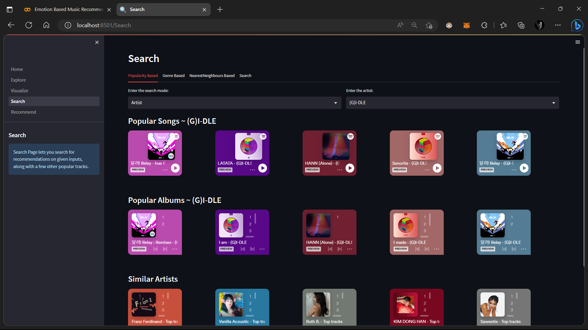
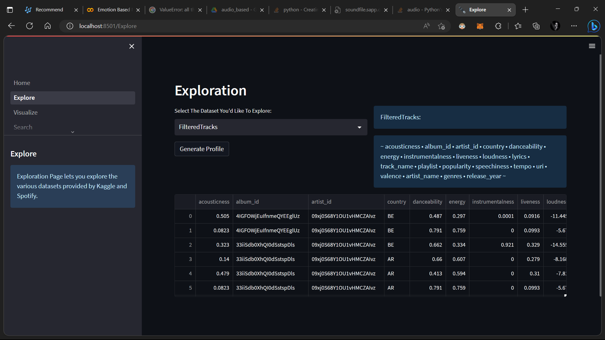
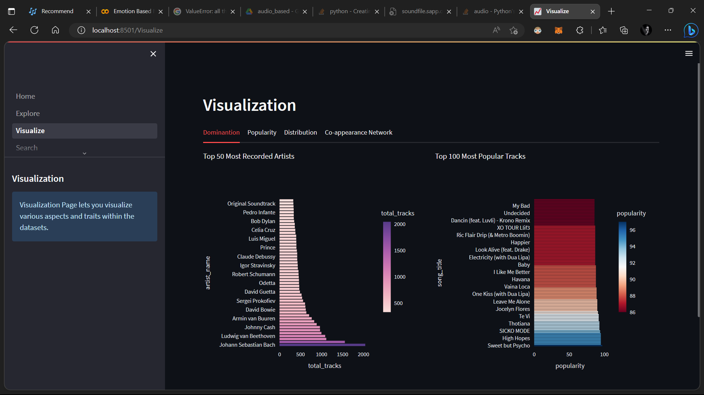
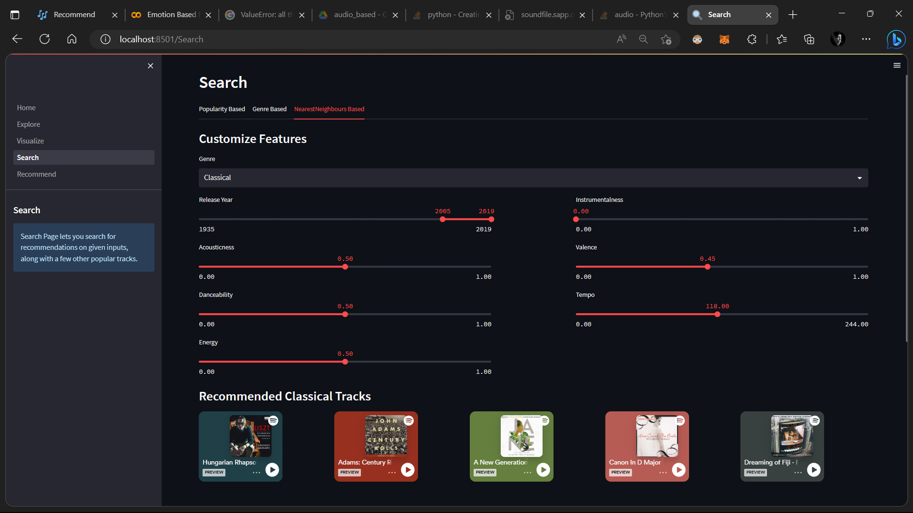
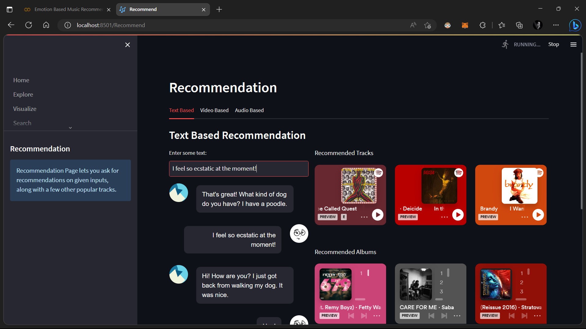

# &#127925; Emotion-Based-Music-Recommendation-System
---

This projects uses Spotify and Genius to recommend music along with Spotify widget. It contains emotion based models trained on texts, videos and audios to provided recommendation via those media.

 
 
 

> For detailed guides, steps and instructions, check out: [Colab Notebook](https://colab.research.google.com/drive/1ahxyp8i9Ngy2nyA5THSOwDzVS99prLMF?usp=sharing)

 
 

This streamlit app contains the following sections:
* &#128393; Explore: This sections lets the user explore all the dataframes required for the webapp.

 

 
 
 

* &#128200; Visualize: This section lets the user visualize the various trends in the dataset, like popularity of the movies, seggregation of the movies into genres/keywords, the vote distribution statistics and the coappearance network of all cast members based on user input.

 

 
 
 

* &#128270; Search: This section lets the user search for recommendations on popular track, albums, artists or parametric features of the search criteria.

 

 
 
 

* &#127909; Recommendation: This section lets the user ask for Text Based, Video Based or Audio Based recommendations, after greeting the user with popular movies specific to a given genre as well as over the entire dataset.

 

 
 

> **Warning**
> modify the env.config file to store the [API Key](https://huggingface.co/facebook/blenderbot-400M-distill?text=Hi.)

 
 

     
     
     
    

    ~ made with ~
    

     
     
    

        

         
         
        

         
         
        

    

